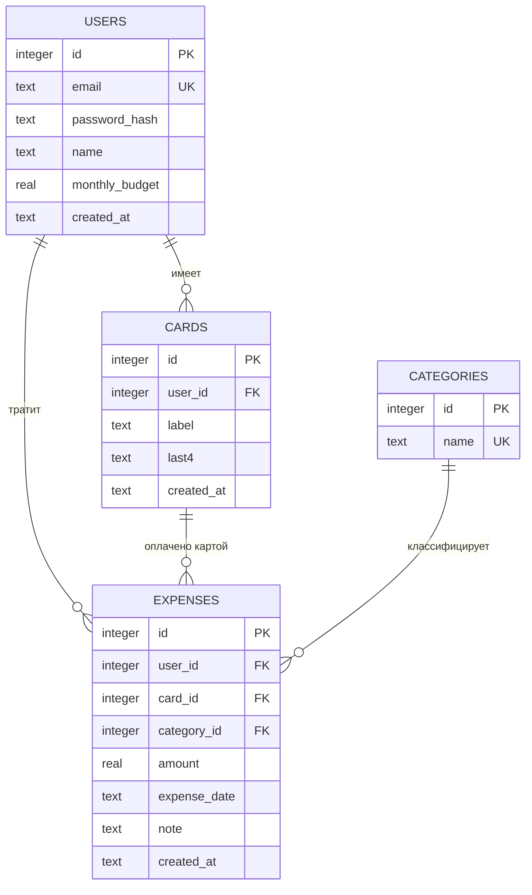

# Архитектура проекта «Учёт личных расходов»

Дополняет [README.md](README.md) (обоснование стека, критерии готовности, запуск).
Здесь — модель данных, спецификация маршрутов и план реализации по этапам.

## 1. Общая архитектура

Монолитное серверное веб-приложение без разделения на отдельный frontend/backend:

```
Браузер (формы, без JS-фреймворка)
        │  HTTP (form POST / GET), сессионная cookie
        ▼
Express-сервер (src/server.js)
  ├─ middleware: express-session (auth), express.urlencoded (парсинг форм)
  ├─ routes/auth.js       — регистрация, вход, выход
  ├─ routes/dashboard.js  — личный кабинет, расходы (CRUD), карты, бюджет
  ├─ models.js            — вся работа с БД (SQL-запросы, агрегация по месяцу)
  └─ views/*.ejs           — серверный рендеринг HTML
        │
        ▼
@libsql/client (SQLite-совместимый)
  ├─ локально: файл data/rashodi.db
  └─ в продакшене: облачная БД Turso (см. DEPLOY.md) — данные переживают
     перезапуск/redeploy на хостингах без постоянного диска
```

Почему монолит с серверным рендерингом, а не SPA + JSON API: функционал ограничен
формами и таблицами (добавить/изменить/удалить расход, посмотреть сводку за месяц),
без сложного клиентского состояния — SPA добавила бы сложность (сборка, роутинг,
отдельный слой сериализации) без выигрыша для пользователя. См. также раздел
«Ответы на открытые вопросы» в README.

## 2. Модель данных



Схема как она создаётся в [src/db/index.js](src/db/index.js) (`CREATE TABLE IF NOT EXISTS`,
`PRAGMA foreign_keys = ON`, каскадное удаление карт/расходов при удалении пользователя,
каскадное удаление расходов при удалении карты):

| Таблица | Ключевые поля | Примечания |
|---|---|---|
| `users` | `email` UNIQUE, `password_hash` (bcrypt), `monthly_budget` | Бюджет — на пользователя, а не на месяц: пользователь меняет его в любой момент, применяется ко всем месяцам. |
| `categories` | `name` UNIQUE | Фиксированный справочник из 3 строк (см. `FIXED_CATEGORIES`), заполняется при старте `INSERT OR IGNORE`. |
| `cards` | `user_id` FK, `last4` | Хранятся **только последние 4 цифры**; полный номер не сохраняется нигде. |
| `expenses` | `user_id`, `card_id`, `category_id` FK, `amount`, `expense_date` | `expense_date` — `TEXT` в формате `YYYY-MM-DD`, что позволяет группировать по месяцу через `substr()`/`BETWEEN` без доп. индексов на дату по месяцам. |

Индекс `idx_expenses_user_date (user_id, expense_date)` — под основной запрос
(сумма/список расходов пользователя за диапазон дат месяца).

## 3. Спецификация маршрутов (API)

Приложение серверное (EJS), поэтому «API» — это HTTP-маршруты, отдающие HTML
(`redirect`/`render`), а не JSON. Все маршруты, кроме `/login`, `/register`,
статики, защищены сессией (`requireAuth`): без активной сессии — редирект на `/login`.
Данные всегда фильтруются по `req.session.userId` — пользователь не может увидеть
или изменить чужие карты/расходы (это же гарантирует `WHERE user_id = ?` во всех
запросах в `models.js`, включая `getExpenseById`/`updateExpense`/`deleteExpense`).

| Метод | Путь | Auth | Назначение | Тело / параметры |
|---|---|---|---|---|
| GET | `/login` | нет (редирект, если уже вошёл) | Форма входа | — |
| POST | `/login` | нет | Проверка email/пароля, создание сессии | `email`, `password` |
| GET | `/register` | нет | Форма регистрации | — |
| POST | `/register` | нет | Создание пользователя, автовход | `email`, `password` (≥6 симв.), `name` |
| POST | `/logout` | да | Завершение сессии | — |
| GET | `/` | да | Личный кабинет: сводка за месяц, список расходов, формы | `?month=YYYY-MM` (по умолчанию текущий) |
| POST | `/expenses` | да | Создать расход | `amount`, `categoryId`, `cardId`, `date`, `note?` |
| GET | `/expenses/:id/edit` | да | Форма редактирования расхода (только своего) | — |
| POST | `/expenses/:id` | да | Обновить расход (только свой) | `amount`, `categoryId`, `cardId`, `date`, `note?` |
| POST | `/expenses/:id/delete` | да | Удалить расход (только свой) | — |
| POST | `/cards` | да | Привязать карту к пользователю | `label`, `cardNumber` (сохраняются только последние 4 цифры) |
| POST | `/budget` | да | Обновить месячный бюджет пользователя | `monthlyBudget` |

Валидация — на сервере (в `routes/*.js`): некорректные данные (пустая сумма ≤ 0,
не выбрана категория/карта, короткий пароль, занятый email) отклоняются с
редиректом обратно на форму или страницей с `error`.

## 4. План реализации по этапам

Проект уже реализован; ниже — как он строился и это же можно использовать как
чек-лист для повторной реализации в другом стеке:

1. **Каркас проекта** — Express + EJS + сессии, структура папок (`db`, `models`,
   `routes`, `views`), `.env`/`.env.example`.
2. **Модель данных** — таблицы `users`, `categories`, `cards`, `expenses`
   ([src/db/index.js](src/db/index.js)), сид фиксированных категорий.
3. **Аутентификация** — регистрация/вход/выход, хэширование пароля bcrypt,
   middleware `requireAuth`/`redirectIfAuthed`.
4. **Карты** — привязка карты к пользователю, хранение только `last4`.
5. **Расходы (CRUD)** — создание, редактирование, удаление, все запросы
   скопированы по `user_id` для изоляции данных между пользователями.
6. **Месячная агрегация** — `getMonthSummary`: сумма за месяц, разбивка по
   категориям, остаток от бюджета, % использования; переключатель месяцев
   (`getAvailableMonths`) для истории.
7. **Личный кабинет (UI)** — карточки со сводкой, донат-диаграмма по категориям,
   цветовой индикатор (зелёный/жёлтый/красный), таблица расходов с действиями.
8. **Демо-данные** — автосоздание демо-пользователя с картами и расходами за
   текущий и прошлый месяц при первом запуске ([src/db/seed.js](src/db/seed.js)).
9. **Доступ с ПК и телефона** — адаптивная вёрстка (таблица расходов скроллится
   отдельно от страницы на узких экранах) и PWA (manifest + service worker),
   чтобы приложение можно было «установить» как отдельное на любом устройстве.
10. **Развёртывание в интернете** — слой БД переведён на `@libsql/client`
    (SQLite-совместимый), который одинаково работает с локальным файлом и с
    облачной БД Turso по `TURSO_DATABASE_URL`/`TURSO_AUTH_TOKEN` — это даёт
    постоянное хранилище на хостингах без диска. Подробности и пошаговая
    инструкция — в [DEPLOY.md](DEPLOY.md).

Не входит в текущий объём (сознательно, см. README): интеграция с банковским API,
свои категории, лимиты по категориям и уведомления, мультивалютность, учёт доходов —
эти пункты были в списке открытых вопросов задачи и закрыты дефолтными решениями,
ограничивающими проект заявленным функционалом.

Возможные следующие шаги для продакшена (тоже вне объёма демо): HTTPS, ротация
`SESSION_SECRET`, rate-limiting на `/login`, полноценные миграции схемы БД вместо
`CREATE TABLE IF NOT EXISTS`, экспорт истории (CSV), пагинация таблицы расходов.
